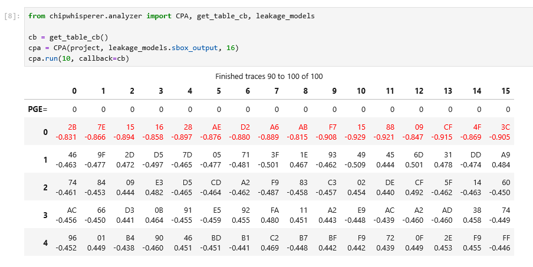
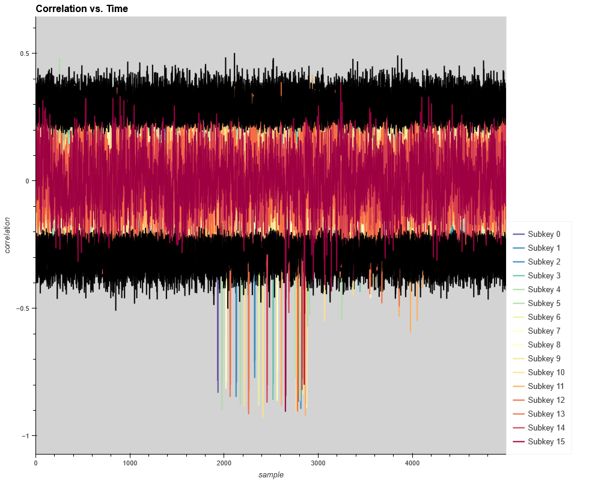
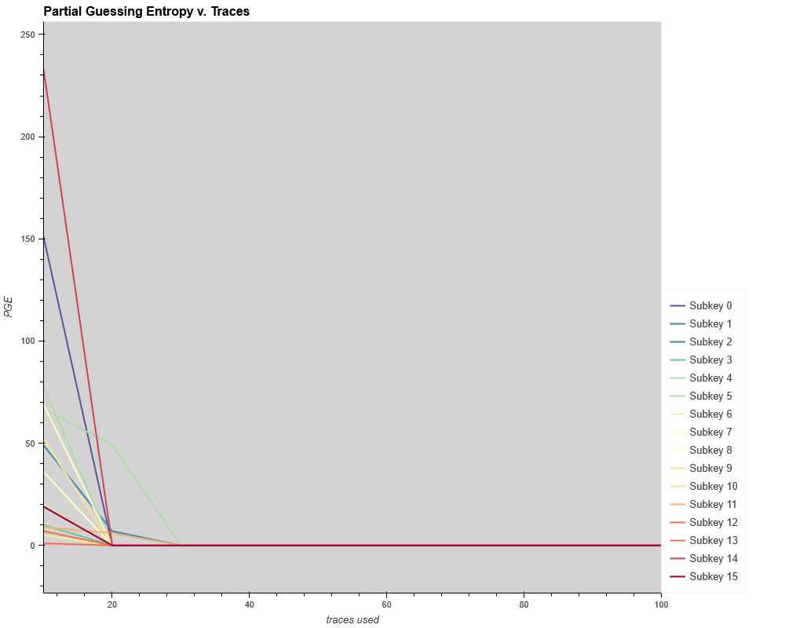
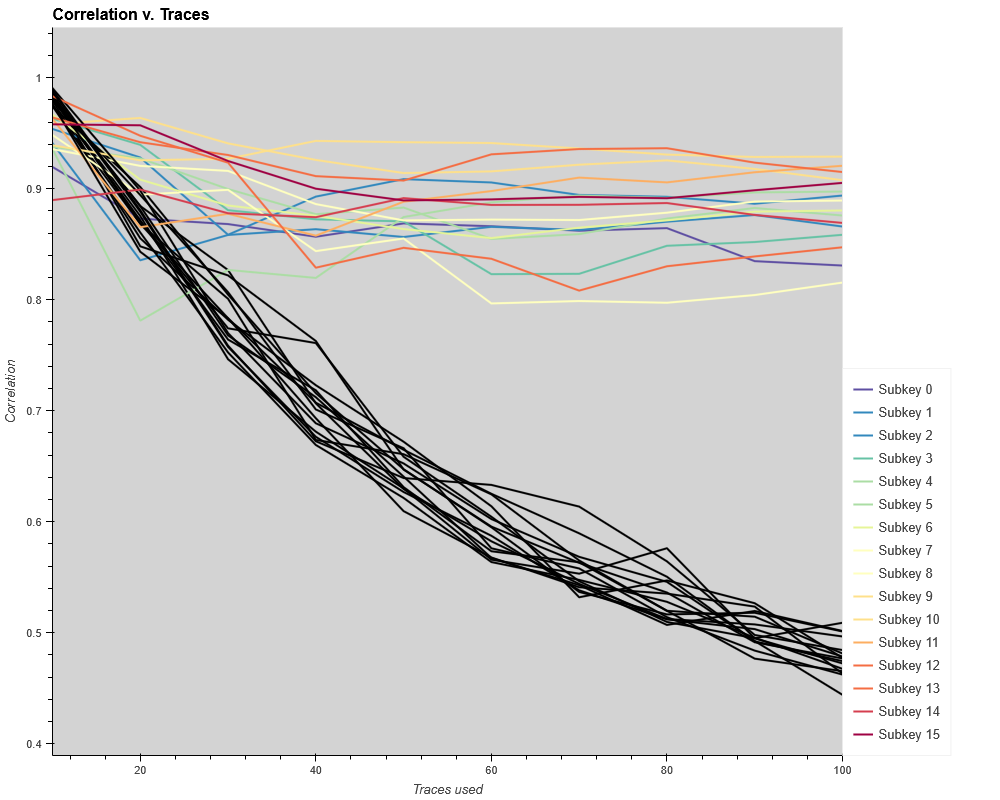

.. _analyzer-api:

************
Analyzer API
************

ChipWhisperer includes a module for analyzing captured code, referred to as Analyzer.

Usage is fairly simple. You can import the analyzer API using::

    from chipwhisperer.analyzer import CPA, leakage_models

Currently, you can only analyze traces using correlation power analysis (CPA). To use
this analysis method, create the CPA object by passing a ChipWhisperer project,
the leakage model you want to use, and the bytes you want to attack::

    cpa = CPA(project, leakage_models.sbox_output, 16)

The attack can then be run::

    cpa.run(10) # update statistics every 10 traces

You can then get the key guess::

    cpa.key_guess()

You can also pass a callback to :code:`cpa.run()`. For example, if you're
running in Jupyter you can get a nice table display::

    from chipwhisperer.analyzer import get_table_cb
    cb = get_table_cb()
    cpa.run(10, callback=cb)

You can also get some nice plots if you're running Analyzer in Jupyter::

    cpa.corr_v_time_plot()

.. code:: python

    cpa.pge_v_traces_plot()

.. code:: python

    cpa.corr_v_traces_plot()

.. autoclass:: chipwhisperer.analyzer.CPA
    :members:

.. _api-analyzer-leakage_models:

Leakage Models
==============

Currently, analyzer only supports a single leakage model :code:`leakage_models.sbox_output`.

.. _api-analyzer-cpa_attack:
