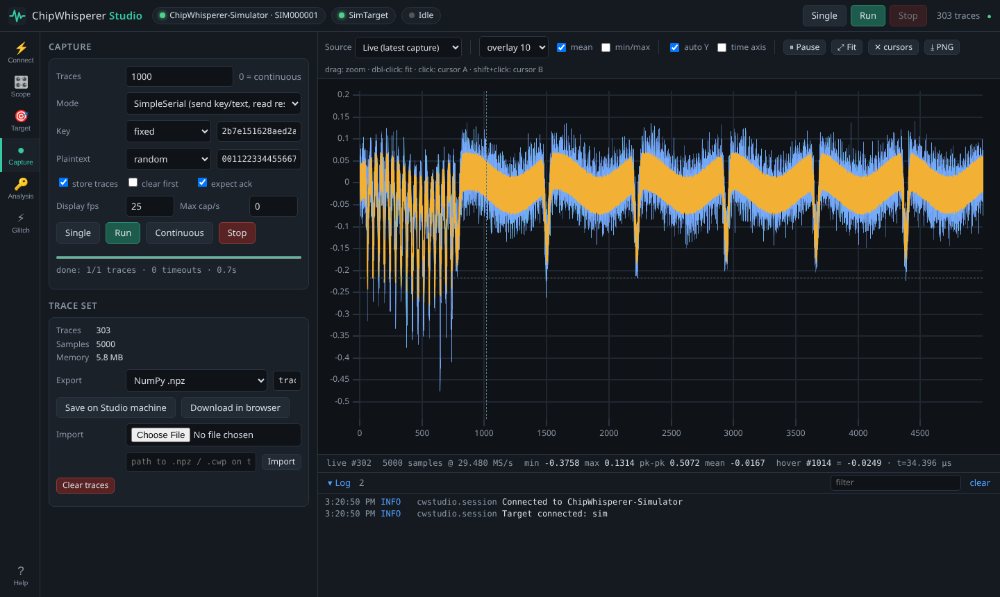
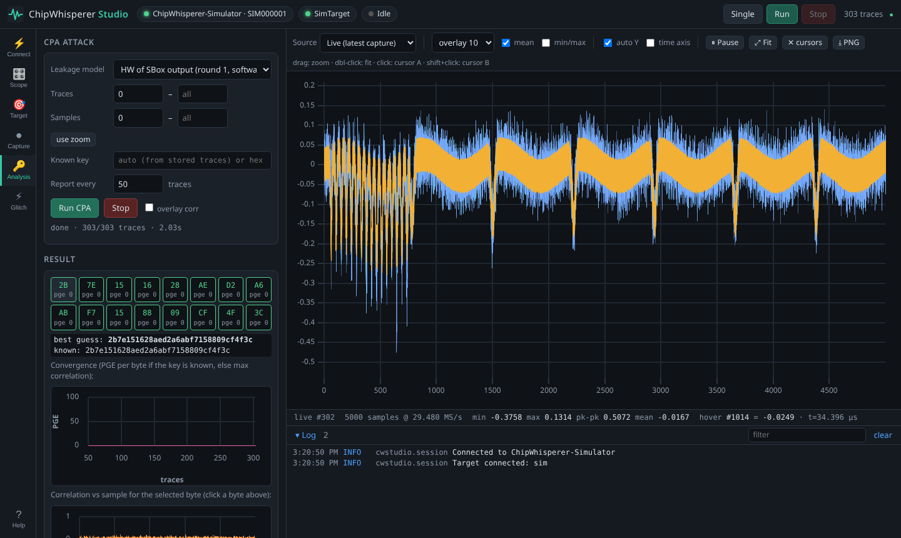

# ChipWhisperer Studio

ChipWhisperer Studio is a standalone desktop application for ChipWhisperer
capture hardware. It lets you connect to a Nano, Lite, Pro or Husky, configure
every scope setting, program and talk to the target, capture traces while
watching the waveform update live, run a CPA attack and sweep glitch
parameters, all without writing Python or opening a notebook.



## Installing

### Standalone (no Python needed)

Download `ChipWhispererStudio-<os>-<arch>.zip` from the GitHub releases page,
unzip it and run:

* **Windows** — `ChipWhispererStudio.exe` (install the NewAE WinUSB driver if the
  device is not detected, see {doc}`drivers`).
* **macOS** — `ChipWhispererStudio` (right-click → Open the first time).
* **Linux** — `./chipwhisperer-studio.sh`. Install the udev rule once; the
  Connect tab shows the exact command.

Your browser opens `http://127.0.0.1:8765/` automatically.

### With Python

```bash
pip install "chipwhisperer[studio]"
cw-studio
```

Run `cw-studio --simulate` to try it without hardware.

## Workflow

1. **Connect** — choose Auto-detect (or a specific device / serial number) and
   press *Connect scope*, then *Connect target* (SimpleSerial v2 for current
   firmware).
2. **Target** — program a `.hex` file with the matching programmer, check the
   target answers in the serial console.
3. **Scope** — adjust gain, samples, offset, trigger and clocks in the settings
   tree. Hover a setting for its documentation. Press *Single* to see a trace.
4. **Capture** — set a trace count and press *Run*. Traces stream to the
   waveform view; overlay the last N traces or show the mean and min/max
   envelope. Export as a ChipWhisperer project (`.cwp`) or `.npz` to continue in
   Python.
5. **Analysis** — run a CPA attack with the leakage model that matches your
   target. With a fixed known key the PGE plot shows every byte converging.
6. **Glitch** — configure the glitch module in the Scope tab, then sweep
   `glitch.width`, `glitch.ext_offset`, … and watch successes appear in the
   scatter plot.



## Remote use and scripting

Start Studio with `--host 0.0.0.0` on the machine attached to the hardware and
open it from any browser on the network. Everything the UI does is available
through the HTTP API documented at `/api/docs`, so you can drive captures from
scripts or CI without the browser.

## Source

The application lives in `software/cwstudio/` (see its `DESIGN.md`) and is
packaged by `packaging/cwstudio/build.py`.
