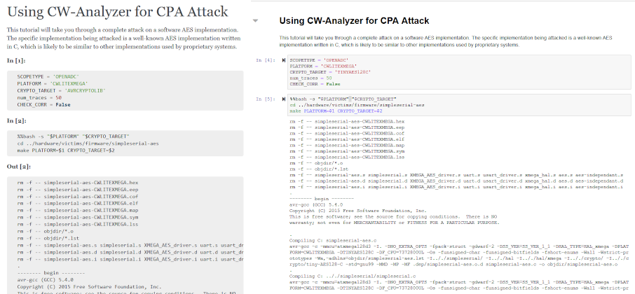

.. _tutorials:

#########
Tutorials
#########

.. toctree::
    :maxdepth: 2
    :hidden:
    :glob:

    tutorials/*

This page covers all the tutorials currently available in the latest version of
ChipWhisperer. These tutorials are all in the form of Jupyter notebooks with
the output generated to follow along.

You may notice that the page style does not look like your jupyter
notebook. This is to keep the page style consistent on this website. The
structure is equivalent. You can identify the jupyter notebooks inputs and
outputs by the same **In []:** and **Out []:** as in the jupyter notebook.

The plots in the tutorials keep their interactivity. This allows you to zoom in
and explore the traces we collected and compare with yours to help you complete
the tutorials.

The tutorials have been grouped into a few different sections each providing
examples of different types of side channel analysis on a target or device
under test. The sidebar is convenient for quickly navigating to the tutorial of
interest and it also the grouping of the tutorials a bit better with indents.

There are two main groups:

:ref:`tutorials-pa`

    This group contains all the tutorials related to power analysis. Recorded
    power consumption of a target during specific operations will allow
    capturing of the secret. This group also contains tutorials serving as
    material used to supplement your understanding of power analysis.

:ref:`tutorials-fault`

    This group contains all the tutorials related to glitching the target. Using
    voltage, and clock glitching to cause the target to perform unintended operations
    or skip operations, potentially exposing the secret or bypassing authentication.

Each tutorial section on this page has links for the jupyter notebook tutorial with
the output for your target. Your hardware will not have exactly the same output when
you follow through with the target, however, it will be close.

.. seealso:: Actually physically connecting wires and setting up the hardware is
    explained on the `wiki`_. This site only contains how to use the jupyter notebooks
    once all the hardware is correctly connected to the computer and extra hardware
    setup steps have been completed.

.. _wiki: https://wiki.newae.com/Main_Page#Hardware_Documentation

.. _tutorials-pa:

**************
Power Analysis
**************

Use the power of power measurements. Measuring the power consumption of the target
during sensitive operations can allow you to determine if the target is leaking
information about its sensitive operation (such as encryption). Analysis of the
power consumption may allow you to recover the secret that should have been
inaccessible inside the target (such as the encyption key).

This groups of tutorials also contains an :ref:`introduction <tutorials-pa-intro>` to
the basics of using the ChipWhisperer hardware for power analysis:

  * :ref:`How to build firmware for the target, and Python API introduction <tutorials-pa-intro-firmware_build_setup>`
  * :ref:`Recognize different machine instructions in the power traces <tutorials-pa-intro-instruction_differences>`
  * :ref:`An introduction to measuring signal-to-noise ratio <tutorials-pa-intro-snr>`

Next, we have some :ref:`simple power analysis <tutorials-pa-spa>` containing one
timing attack:

  * :ref:`How to use timing analysis to bypass authentication measures <tutorials-pa-spa-password_bypass>`

Then we move on to :ref:`differential power analysis <tutorials-pa-dpa>`. Begin to
learn how use statistics on a collection of power traces to gain insights into the
targets internal operations and use this to determine the secret.

  * :ref:`Explore the relationship between the hamming weight of a AES output and the power trace <tutorials-pa-dpa-hw_measurement>`
  * :ref:`See how large change in hamming weight change the power trace <tutorials-pa-dpa-hw_swings>`.

.. _cpa https: https://wiki.newae.com/Correlation_Power_Analysis

.. _tutorials-pa-intro:

Introduction Tutorials
======================

.. _tutorials-pa-intro-firmware_build_setup:

Firmware Build Setup
--------------------
Become familiar with the basics of the ChipWhisperer Python API and using
Jupyter.

Supported Targets:

  * :ref:`XMEGA <tutorial-pa_intro_1-openadc-cwlitexmega>`
  * :ref:`ARM (STM32F3) <tutorial-pa_intro_1-openadc-cwlitearm>`
  * :ref:`ChipWhisperer Nano <tutorial-pa_intro_1-cwnano-cwnano>`

.. _tutorials-pa-intro-instruction_differences:

Instruction Differences
-----------------------
See how power traces change based on what a target is executing.

Supported Targets:

  * :ref:`XMEGA <tutorial-pa_intro_2-openadc-cwlitexmega>`
  * :ref:`ARM (STM32F3) <tutorial-pa_intro_2-openadc-cwlitearm>`
  * :ref:`ChipWhisperer Nano <tutorial-pa_intro_2-cwnano-cwnano>`

.. _tutorials-pa-intro-snr:

Measuring Signal To Noise Ratio of Target
-----------------------------------------
See how the signal to noise ratio of power traces vary during AES.

Supported Targets:

  * :ref:`XMEGA <tutorial-pa_intro_3-openadc-cwlitexmega>`
  * :ref:`ARM (STM32F3) <tutorial-pa_intro_3-openadc-cwlitearm>`
  * :ref:`ChipWhisperer Nano <tutorial-pa_intro_3-cwnano-cwnano>`

.. _tutorials-pa-spa:

Simple Power Analysis
=====================

.. _tutorials-pa-spa-password_bypass:

Timing Analysis with Power for Password Bypass
----------------------------------------------
Use simple power analysis to reveal a target's password, byte by byte.

Supported Targets:

  * :ref:`XMEGA <tutorial-pa_spa_1-openadc-cwlitexmega>`
  * :ref:`ARM (STM32F3) <tutorial-pa_spa_1-openadc-cwlitearm>`

..  * :ref:`ChipWhisperer Nano <tutorial-pa_spa_1-cwnano-cwnano>`

.. _tutorials-pa-dpa:

Differential Power Analysis
===========================

.. _tutorials-pa-dpa-hw_measurement:

Hamming Weight Measurement
--------------------------
Determine the relationship between the hamming weight of an AES output value
and power traces.

Supported Targets:

  * :ref:`XMEGA <tutorial-pa_dpa_1-openadc-cwlitexmega>`
  * :ref:`ARM (STM32F3) <tutorial-pa_dpa_1-openadc-cwlitearm>`

..  * :ref:`ChipWhisperer Nano <tutorial-pa_dpa_1-cwnano-cwnano>`

.. _tutorials-pa-dpa-hw_swings:

Large Hamming Weight Swings
---------------------------
See how large changes in hamming weight affect power traces.

Supported Targets:

  * :ref:`XMEGA <tutorial-pa_dpa_2-openadc-cwlitexmega>`
  * :ref:`ARM (STM32F3) <tutorial-pa_dpa_2-openadc-cwlitearm>`
  * :ref:`ChipWhisperer Nano <tutorial-pa_dpa_2-cwnano-cwnano>`

.. _tutorials-pa-dpa-AES_attack:

Advanced Encryption Standard Differential Power Analysis Attack
---------------------------------------------------------------
Use a Differential Power Analysis (DPA) attack to break AES.

Supported Targets:

..  * :ref:`XMEGA <tutorial-pa_dpa_3-openadc-cwlitexmega>`

  * :ref:`ARM (STM32F3) <tutorial-pa_dpa_3-openadc-cwlitearm>`

..  * :ref:`ChipWhisperer Nano <tutorial-pa_dpa_3-cwnano-cwnano>`

Correlation Power Analysis
===========================

Using ChipWhisperer Analyzer for Correlation Power Analysis Attack
------------------------------------------------------------------
Use Correlation Power Analysis (CPA) and ChipWhisperer Analyzer to discover the
secret key of a device running AES.

Supported Targets:

  * :ref:`XMEGA <tutorial-pa_cpa_1-openadc-cwlitexmega>`
  * :ref:`ARM (STM32F3) <tutorial-pa_cpa_1-openadc-cwlitearm>`
  * :ref:`ChipWhisperer Nano <tutorial-pa_cpa_1-cwnano-cwnano>`

Manual Correlation Power Analysis Attack
----------------------------------------
Repeat the attack of PA_CPA_1 without using ChipWhisperer Analyzer, learning in
detail about how CPA attacks work.

Supported Targets:

  * :ref:`XMEGA <tutorial-pa_cpa_2-openadc-cwlitexmega>`
  * :ref:`ARM (STM32F3) <tutorial-pa_cpa_2-openadc-cwlitearm>`
  * :ref:`ChipWhisperer Nano <tutorial-pa_cpa_2-cwnano-cwnano>`

Resynchronizing Data Traces
---------------------------
Use ChipWhisperer Analyzer to break a device trying to use variable delays to
disrupt a side channel attack.

Supported Targets:

..  * :ref:`XMEGA <tutorial-pa_cpa_3-openadc-cwlitexmega>`

  * :ref:`ARM (STM32F3) <tutorial-pa_cpa_3-openadc-cwlitearm>`
  * :ref:`ChipWhisperer Nano <tutorial-pa_cpa_3-cwnano-cwnano>`

Attacking 32-bit Advanced Encryption Standard
---------------------------------------------
Break an AES implementation that uses 32 bit operations instead of 8 bit
operations (as in the previous PA_CPA attacks). Goes into additional theory
about how 32 bit AES differs from 8 bit AES.

Supported Targets:

..  * :ref:`ARM (STM32F3) <tutorial-pa_cpa_4-openadc-cwlitearm>`

..  * :ref:`ChipWhisperer Nano <tutorial-pa_cpa_4-cwnano-cwnano>`

Multiple Analysis Tutorials
===========================

Breaking AES-256 Bootloader
---------------------------
Use CPA, DPA, and SPA attacks to reveal the secrets of a target's AES256-CBC
bootloader.

Supported Targets:

..  * :ref:`XMEGA <tutorial-pa_multi_1-openadc-cwlitexmega>`

  * :ref:`ARM (STM32F3) <tutorial-pa_multi_1-openadc-cwlitearm>`

Profiling Attacks
=================

Template Attacks with Hardware Assumption
-----------------------------------------
Build up information about a target to break a similar one in only a few
traces.

Supported Targets:

  * :ref:`XMEGA <tutorial-pa_profiling_1-openadc-cwlitexmega>`
  * :ref:`ARM (STM32F3) <tutorial-pa_profiling_1-openadc-cwlitearm>`

Test Vector Leakage Assessment
==============================

Performing TVLA Testing for Crypto Validation
---------------------------------------------
Use a TVLA test to identify spots in power traces where information is being
leaked.

Supported Targets:

  * :ref:`XMEGA <tutorial-pa_tvla_1-openadc-cwlitexmega>`
  * :ref:`ARM (STM32F3) <tutorial-pa_tvla_1-openadc-cwlitearm>`
  * :ref:`ChipWhisperer Nano <tutorial-pa_tvla_1-cwnano-cwnano>`

.. _tutorials-fault:

*****
Fault
*****

Introduction to Clock Glitch Attacks
====================================
Introduce faults in a target's clock to skip instructions and wreak havoc.

Supported Targets:

  * :ref:`XMEGA <tutorial-fault_1-openadc-cwlitexmega>`
  * :ref:`ARM (STM32F3) <tutorial-fault_1-openadc-cwlitearm>`

Introduction to Vcc Glitching Attacks
=====================================
Disrupt a target's power to corrupt its calculations.

Supported Targets:

  * :ref:`ARM (STM32F3) <tutorial-fault_2-openadc-cwlitearm>`

.. * :ref:`ChipWhisperer Nano <tutorial-fault_2-cwnano-cwnano>`

Glitch Buffer Attacks
=====================
Use clock glitching to skip past the end of a buffer and dump parts of SRAM.

Supported Targets:

  * :ref:`XMEGA <tutorial-fault_3-openadc-cwlitexmega>`
  * :ref:`ARM (STM32F3) <tutorial-fault_3-openadc-cwlitearm>`

AES Differential Fault Analysis Attack
======================================
Use clock glitching to introduce faults in AES calculations to recover an AES
key.

Supported Targets:

..  * :ref:`XMEGA <tutorial-fault_4-openadc-cwlitexmega>`

  * :ref:`ARM (STM32F3) <tutorial-fault_4-openadc-cwlitearm>`

RSA Fault Attack
================
Use clock glitching to fault RSA calculations and recover a device's RSA key.

Supported Targets:

  * :ref:`ARM (STM32F3) <tutorial-fault_5-openadc-cwlitearm>`