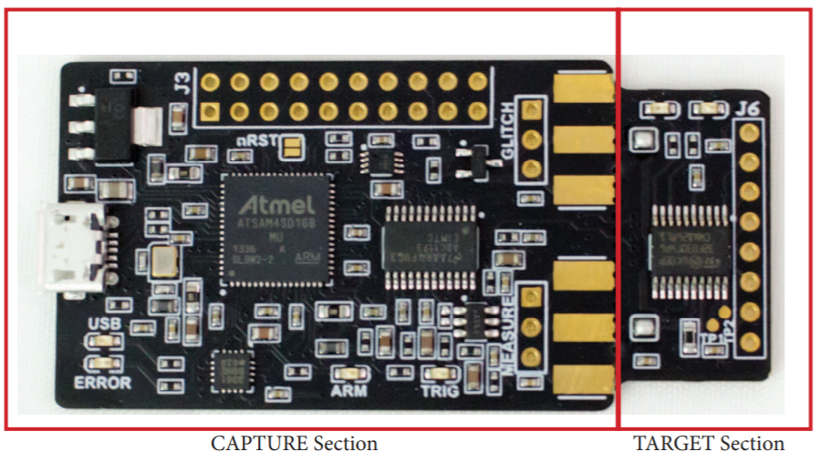

# ChipWhisperer-Nano

ChipWhisperer-Nano is a super-low cost SCA platform (with even some glitching support).

You can check out the [Tutorials](https://chipwhisperer.readthedocs.io/en/latest/tutorials.html) - note many of them work on the CWNANO (but not all). This lets you do attacks like password checks, AES, etc.

ChipWhisperer-Nano is available from [https://www.mouser.com/Search/Refine?Keyword=CWNANO](https://www.mouser.com/Search/Refine?Keyword=CWNANO "Mouser") .

## Source Code

This repo has the schematic + firmware, PCBs are not yet included (unclear release plans for them).

## Integration with Dev Boards / OEM

ChipWhisperer-Nano is available under non-FOSS license as part of a module to be integrated with development boards, in order to show off DPA resistance of devices. Contact NewAE for more details.